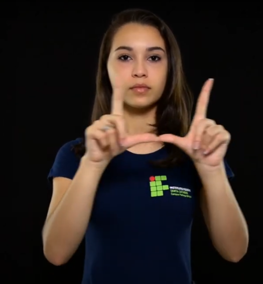
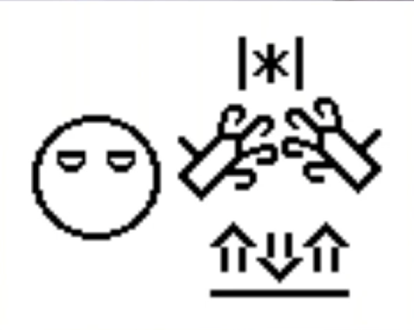
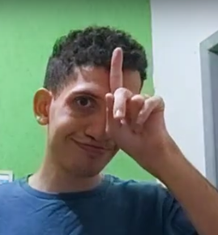
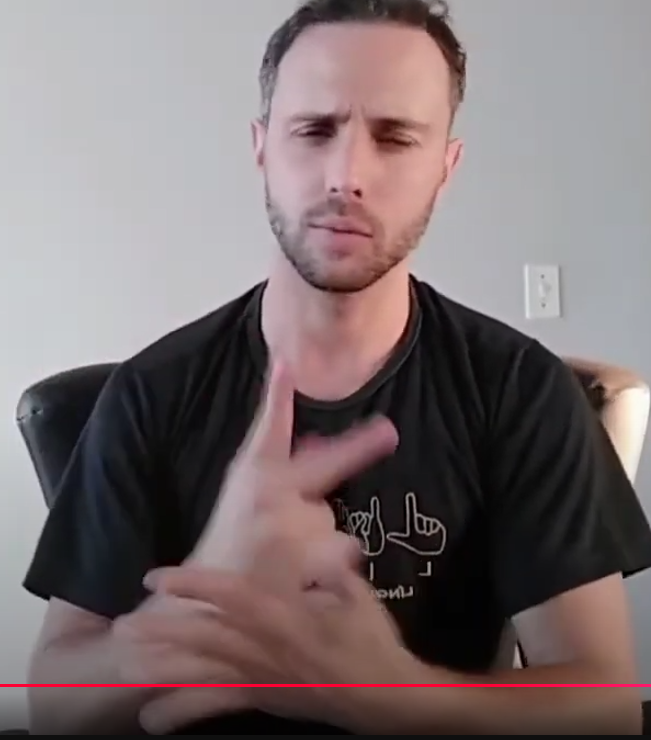
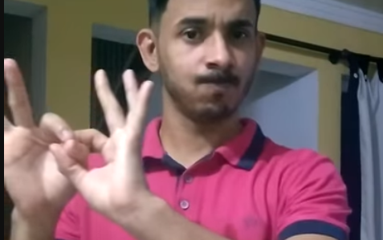

 oi
 
 filme mts [cenas] lindas 
 

mas eu quero mostrar uma fazer [refletir]
 

 cena V [confundir] sinais da frase "prazer conhecer voce"

fala "aprendi no [youtube]" 
{filme com y}

cena importante pq mostrar dificil aprender libras [sem] curso ou professor

youtube é [principal] >fonte< aprender libras
{saudação}

mas tem muitos sinais [errados] ou sem→ [contexto]
 

gostei cena filme mostrar dificil encontrar >fonte< confiavel para aprender libras