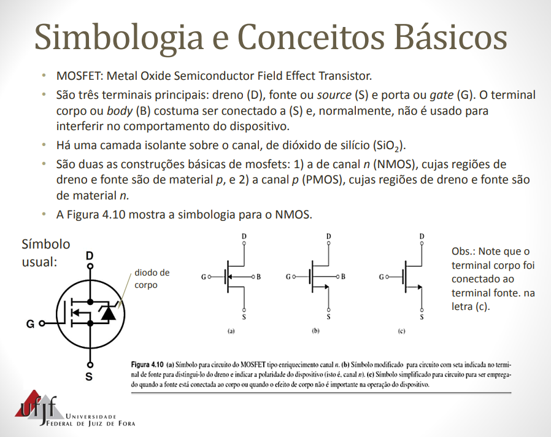
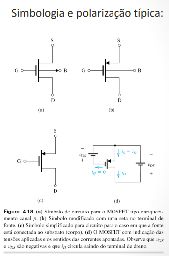

# UFSM00051 - Concepção de Circuitos Integrados

> Circuitos Eletrônicos

## Formação do Canal do Transistor MOS

Quando uma tensão $Vg$ é aplicada sobre o transistor, o boro recebe um eletron (ficando com 4) e se torna um íon.  

## Virtuoso

[Virtuoso layout tutorial](https://www.youtube.com/watch?v=X-ke0KeekQE)

```sh
ssh -X ****.**@192.168.139.58
```

## Simulador LT SPICE

## nMos



## pMos


