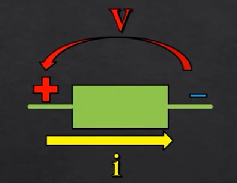
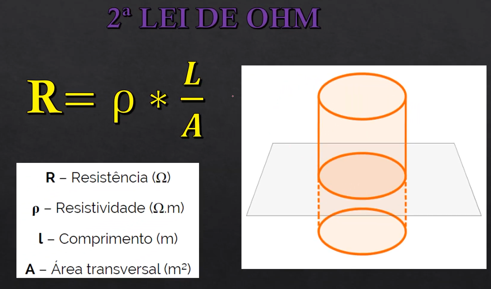
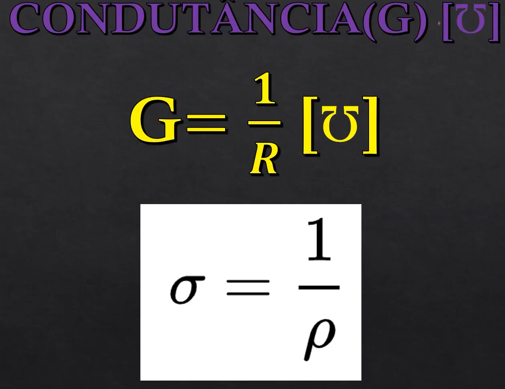
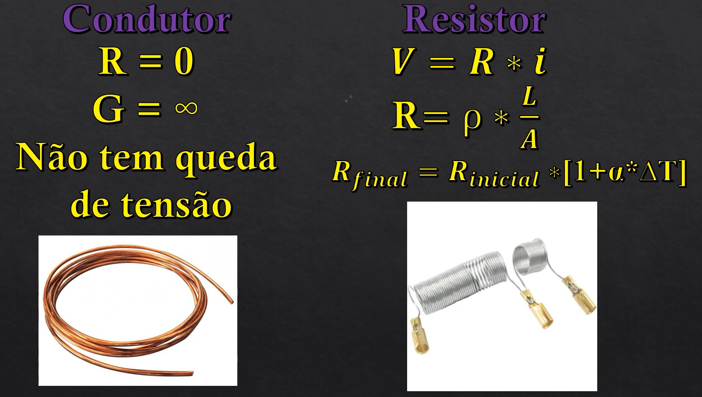

# Tópicos de Circuitos Elétricos 1

- Análise Modal
- Análise Malha
- Teorema de Thevinin e Norton
- Lei das Correntes de Kirshhoff
- Lei das Tensões de Kirshhoff
- Circuitos de Primeira Ordem
- Circuitos de Segunda Ordem

## Fórmulas

- Potência Elétrica

> $\displaystyle P(t)=\frac{\Delta E}{\Delta t} = \frac{d[E(t)]}{dt}=\frac{dE}{dQ}\cdot\frac{dq}{dt}=V \cdot i [W]$

P = Potência [Watt]  
E = Energia  
q = Carga  
t = tempo  
V = tensão  
i = corrente  

- $V(t) = Vm \cdot Sin(w \cdot A)$
- $T= \frac{2\pi}{w}$

## Bipolos

- **Resistor** - Dissipa energia
- **Capacitor** - Armazena energia em forma de campo elétrico
- **Indutor** - Armazena energia em forma de campo magnético

### Elemento Ativo

Fornece energia para o circuito

> Tensão aponta para o polo positivo (+)
> Corrente sai do polo positivo (+)

### Elemento Passivo

Consome ou armazena energia

> Tensão aponta para o polo positivo (+)
> Corrente entra pelo polo positivo (+)

## Leis de Ohm

