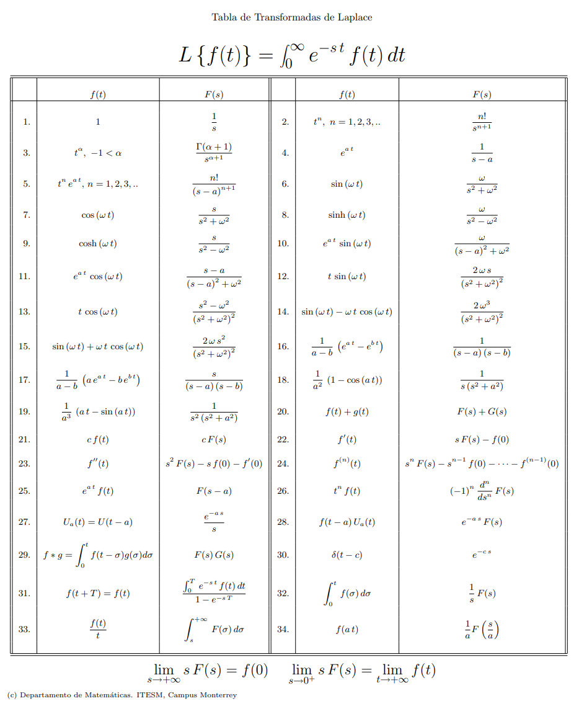

# UFSM00066 - Sistemas Dinâmicos

## Ementa

1. Transformada de Laplace e análise de resposta a diferentes entradas.
2. Modelagem Dinâmica: Sistemas elétricos, mecânicos, etc; Representação matemática, análise no domínio do tempoo; Identificação de sistemas de primeira e segunda ordem.
3. Resposta em frequência: analise de polos e zeros, frequencia natural, diagrama de Bode, analise de estabilidade. Diagramas de Nyquist e Bode.
4. Diagrama de Blocos: Realimentação de sistemas, associação serie paralelo, simplificação.
5. Controle PID. Métodos de sintonia de controladores PID.

## Bibliografia

- Ogata, K. Engenharia de Controle Moderno. 5ª edição, Pearson 2011;
- DORF, R. C., Sistemas de Controle Moderno. São Paulo: Rio de Janeiro: LTC, ed. 11, 2009;
- DESOER, C. A., Teoria básica de circuitos / Rio de Janeiro Guanabara Dois 1979 823 p;
- CARVALHO, J. L. M., Sistemas de Controle Automático, Rio de Janeiro: LTC, ed. 1, 2000;

## Links

- [Markdown Math Db](https://rpruim.github.io/s341/S19/from-class/MathinRmd.html)
- [Extended TeX](https://pt.wikipedia.org/wiki/Ajuda:Guia_de_edi%C3%A7%C3%A3o/F%C3%B3rmulas_TeX)
- [GitHub Flavored Markdown](https://github.github.com/gfm/)
- [Basic Writing and Formatting Syntax](https://docs.github.com/en/get-started/writing-on-github/getting-started-with-writing-and-formatting-on-github/basic-writing-and-formatting-syntax)

## Tabelas

## Infográfico

