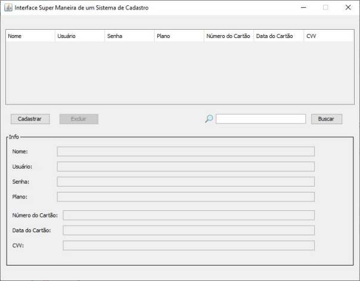
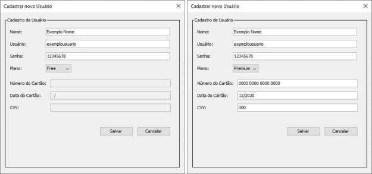
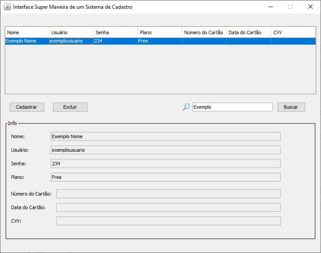
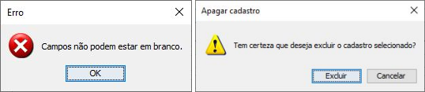

# Interface de um Sistema de Cadastro
Interface em java de um sistema de cadastro sem database (gravado na memória).

## Descrissão
O programa recebe o cadastro de usuários tipo free ou premium e armazena os atributos nome, usuário, senha e plano, pela classe User.java;  
Caso o plano seja premium, ele cadastra mais os atributos número do cartão, data do cartão e cvv, da classe filha PremiumUser.java;  
Há um campo para pesquisa para filtrar a tabela por nome.  
Os cadastros podem ser selecionados por clique no mouse ou pelas setas para cima ou para baixo.

## Desenvolvimento
Autor: Wagner Chittó  
Plataforma: NetBeans IDE 8.2  
Versão do Java: jdk-8u271-windows-x64

## Demonstração

O programa recebe o cadastro de usuários tipo free ou premium e armazena os atributos nome, usuário, senha e plano, pela classe User.java;
Caso o plano seja premium, ele cadastra mais os atributos número do cartão, data do cartão e cvv, da classe filha PremiumUser.java;
Há um campo para pesquisa para filtrar a tabela por nome.
Os cadastros podem ser selecionados por clique no mouse ou pelas setas para cima ou para
baixo.

O método main roda pela interface ClientGUI.java que abre a janela:

O botão de cadastro abre outra janela que recebe os atributos conforme a seleção do plano:

O cadastro atualiza a tabela e ao selecionar um dos ítens, as informações são exibidas em um
bloco:

Avisos e confirmações lidam com erro de usuário:

