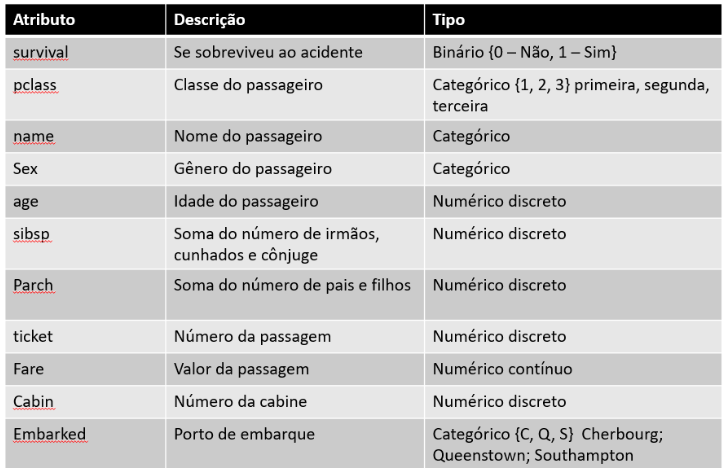
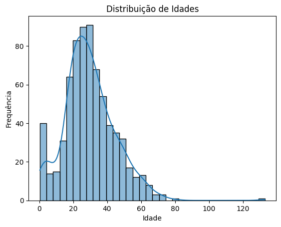
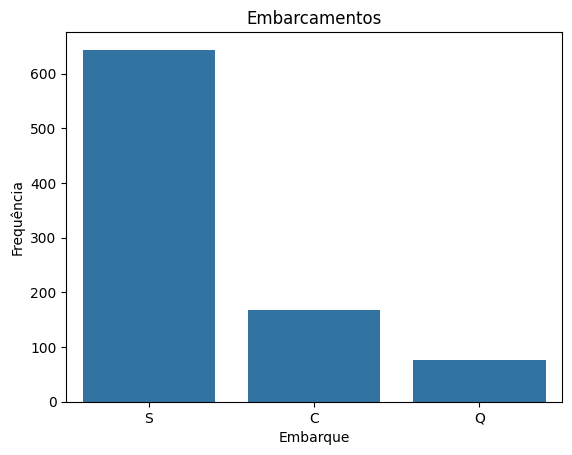
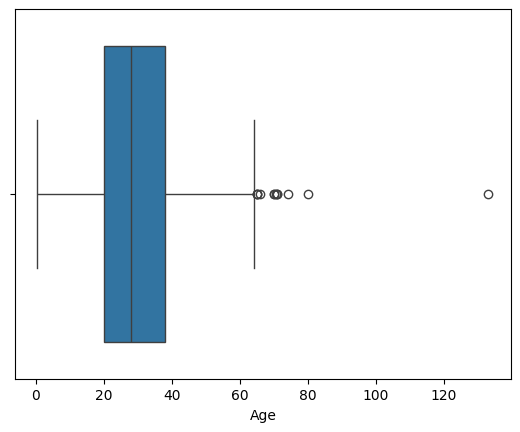

# Limpeza e qualidade de dados

Como exemplos, vamos trabalhar com o conjunto de dados sobre o navio Titanic. Esse é um conjunto de dados estruturado que é muito utilizado na introdução à análise de dados, à ciência de dados, à mineração de dados, etc. Portanto, há muito material e técnicas envolvendo esse conjunto como exemplo, o que facilita o aprendizado. Vamos ver como são os atributos desse dataset.

```python
import pandas as pd
df_titanic=pd.read_csv('titanic_custom.csv')
df_titanic.head()
```

```output

PassengerId Survived Pclass Name Sex Age SibSp Parch Ticket Fare Cabin Embarked
0 1 0 3 Braund, Mr. Owen Harris male 22.0 1 0 A/5 21171 7.2500 NaN S
1 2 1 1 Cumings, Mrs. John Bradley (Florence Briggs Th... female 38.0 1 0 PC 17599 71.2833 C85 C
2 3 1 3 Heikkinen, Miss. Laina female 26.0 0 0 STON/O2. 3101282 7.9250 NaN S
3 4 1 1 Futrelle, Mrs. Jacques Heath (Lily May Peel) female 35.0 1 0 113803 53.1000 C123 S
4 5 0 3 Allen, Mr. William Henry male 35.0 0 0 373450 8.0500 NaN S
```



### Detecção de outliers

```python
df_titanic.duplicated().sum()
```

```sh
np.int64(0)
```

### Detecção de duplicatas

```python
df_titanic.info()
```

```sh
<class 'pandas.core.frame.DataFrame'>
RangeIndex: 891 entries, 0 to 890
Data columns (total 12 columns):
 #   Column       Non-Null Count  Dtype  
---  ------       --------------  -----  
 0   PassengerId  891 non-null    int64  
 1   Survived     891 non-null    int64  
 2   Pclass       891 non-null    int64  
 3   Name         891 non-null    object 
 4   Sex          891 non-null    object 
 5   Age          714 non-null    float64
 6   SibSp        891 non-null    int64  
 7   Parch        891 non-null    int64  
 8   Ticket       891 non-null    object 
 9   Fare         891 non-null    float64
 10  Cabin        204 non-null    object 
 11  Embarked     889 non-null    object 
dtypes: float64(2), int64(5), object(5)
memory usage: 83.7+ KB
```

```python
df_titanic2 = df_titanic.drop ('Cabin', axis=1)
df_titanic2.info()
```

```sh
<class 'pandas.core.frame.DataFrame'>
RangeIndex: 891 entries, 0 to 890
Data columns (total 11 columns):
 #   Column       Non-Null Count  Dtype  
---  ------       --------------  -----  
 0   PassengerId  891 non-null    int64  
 1   Survived     891 non-null    int64  
 2   Pclass       891 non-null    int64  
 3   Name         891 non-null    object 
 4   Sex          891 non-null    object 
 5   Age          714 non-null    float64
 6   SibSp        891 non-null    int64  
 7   Parch        891 non-null    int64  
 8   Ticket       891 non-null    object 
 9   Fare         891 non-null    float64
 10  Embarked     889 non-null    object 
dtypes: float64(2), int64(5), object(4)
memory usage: 76.7+ KB
```

```python
media_idade = df_titanic2['Age'].mean()
mediana_idade = df_titanic2['Age'].median()

print("Média de idade:", media_idade)
print("Mediana de idade:", mediana_idade)

```

```output
Média de idade: 29.839173669467783
Mediana de idade: 28.0
```

```python
df_titanic2['Age'].fillna(media_idade)
```

```sh
 Age
0 22.000000
1 38.000000
2 26.000000
3 35.000000
4 35.000000
... ...
886 27.000000
887 19.000000
888 29.839174
889 26.000000
890 32.000000
891 rows × 1 columns


dtype: float64
```

```pyton
df_titanic2.describe()
```

```sh
 PassengerId Survived Pclass Age SibSp Parch Fare
count 891.000000 891.000000 891.000000 714.000000 891.000000 891.000000 891.000000
mean 446.000000 0.383838 2.308642 29.839174 0.523008 0.381594 37.234698
std 257.353842 0.486592 0.836071 15.031655 1.102743 0.806057 173.359298
min 1.000000 0.000000 1.000000 0.420000 0.000000 0.000000 -10.100000
25% 223.500000 0.000000 2.000000 20.125000 0.000000 0.000000 7.910400
50% 446.000000 0.000000 3.000000 28.000000 0.000000 0.000000 14.454200
75% 668.500000 1.000000 3.000000 38.000000 1.000000 0.000000 31.000000
max 891.000000 1.000000 3.000000 133.000000 8.000000 6.000000 5012.329200

```

```python
import matplotlib.pyplot as plt
import seaborn as sns

sns.histplot(df_titanic2['Age'], kde=True)
plt.title('Distribuição de Idades')
plt.xlabel('Idade')
plt.ylabel('Frequência')
plt.show()
```



```python
sns.countplot(x='Embarked', data=df_titanic2)
plt.title('Embarcamentos')
plt.xlabel('Embarque')
plt.ylabel('Frequência')
plt.show()
```



```python
df_titanic2['Age'].fillna(media_idade, inplace=True)

df_titanic2.to_csv('titanic_semValoresFaltantes.csv', index=False)

df_titanic2['Embarked'].fillna('S', inplace = True)

df_titanic2.info()
```

```sh
<class 'pandas.core.frame.DataFrame'>
RangeIndex: 891 entries, 0 to 890
Data columns (total 11 columns):
 #   Column       Non-Null Count  Dtype  
---  ------       --------------  -----  
 0   PassengerId  891 non-null    int64  
 1   Survived     891 non-null    int64  
 2   Pclass       891 non-null    int64  
 3   Name         891 non-null    object 
 4   Sex          891 non-null    object 
 5   Age          891 non-null    float64
 6   SibSp        891 non-null    int64  
 7   Parch        891 non-null    int64  
 8   Ticket       891 non-null    object 
 9   Fare         891 non-null    float64
 10  Embarked     891 non-null    object 
dtypes: float64(2), int64(5), object(4)
memory usage: 76.7+ KB
```

```python
sns.boxplot(x=df_titanic2['Age'])
plt.show()
```



```python
print(df_titanic2.sort_values('Age', ascending=False).head(5)['Age'])
print(df_titanic2.sort_values('Age', ascending=True).head(5)['Age'])
```

```sh
103    133.0
630     80.0
851     74.0
493     71.0
96      71.0
Name: Age, dtype: float64
803    0.42
755    0.67
644    0.75
469    0.75
78     0.83
Name: Age, dtype: float64
```

```python
df_titanic2.loc[df_titanic['Age'] == 133, 'Age'] = mediana_idade

print(df_titanic2.sort_values('Age', ascending=False).head(5)['Age'])
```

```sh
630    80.0
851    74.0
96     71.0
493    71.0
116    70.5
Name: Age, dtype: float64
```
