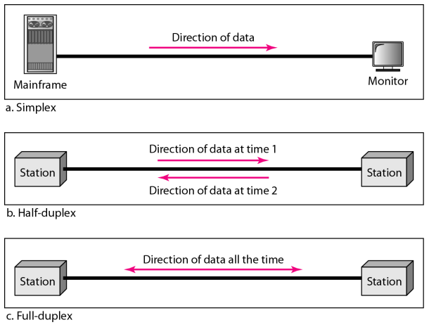
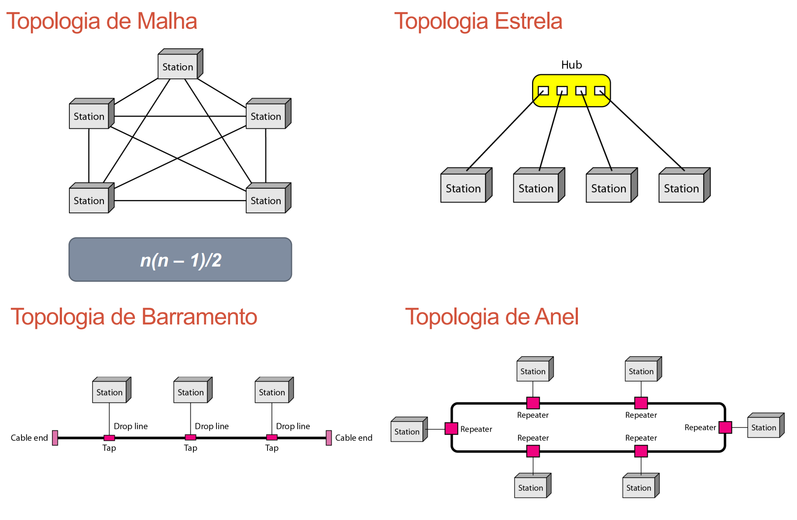
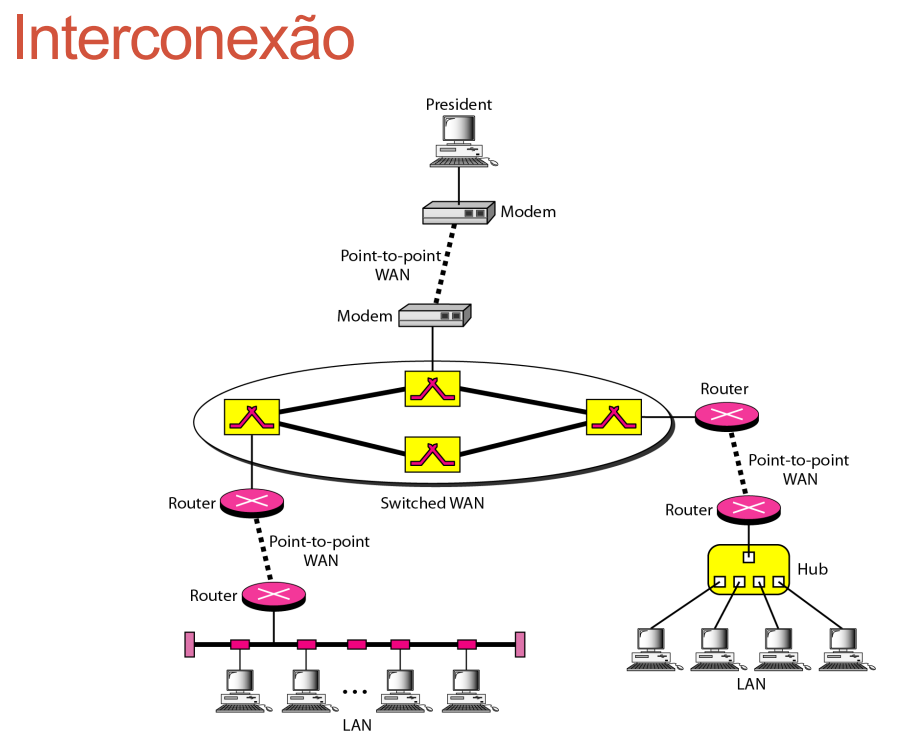
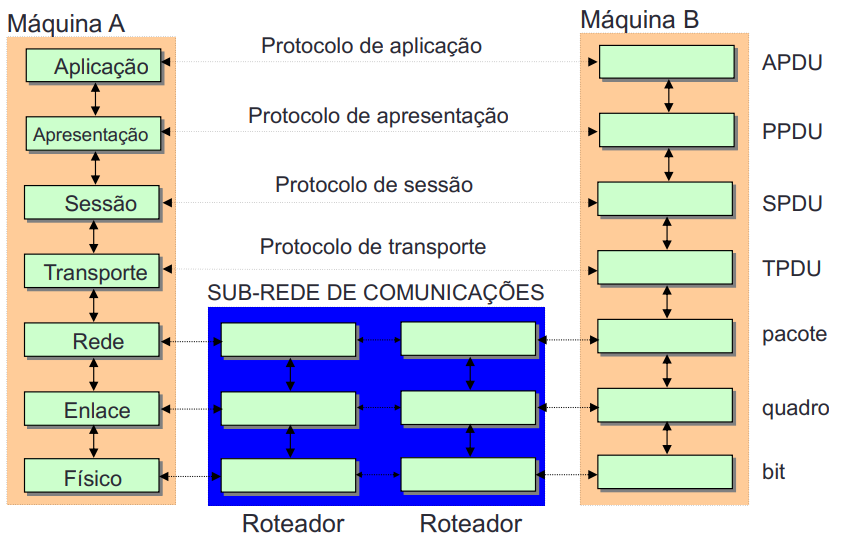
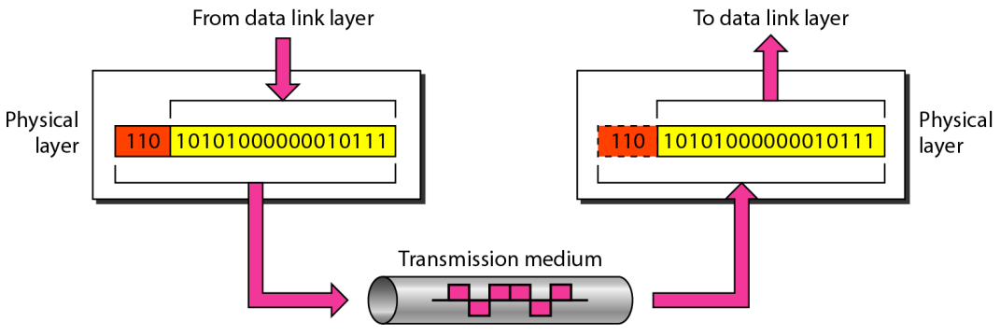
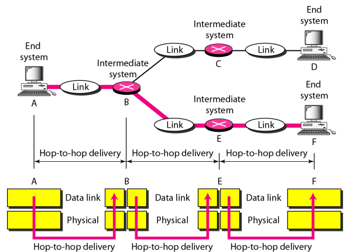
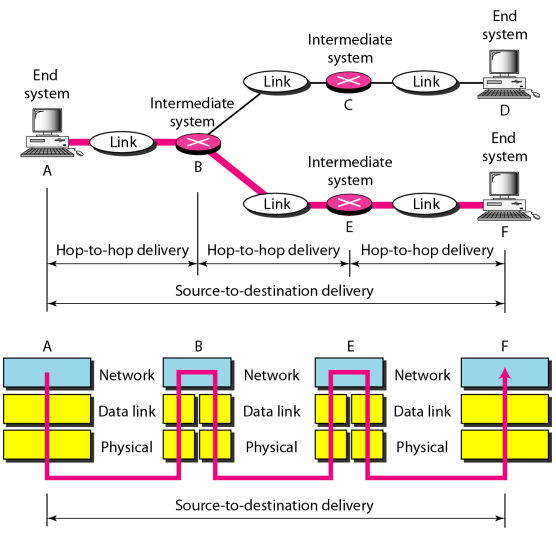
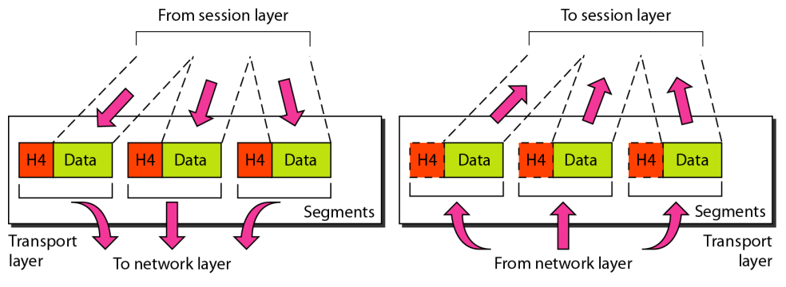
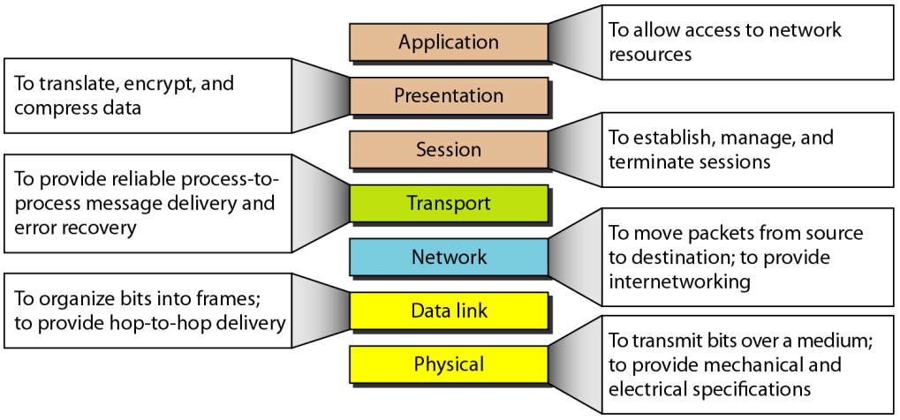
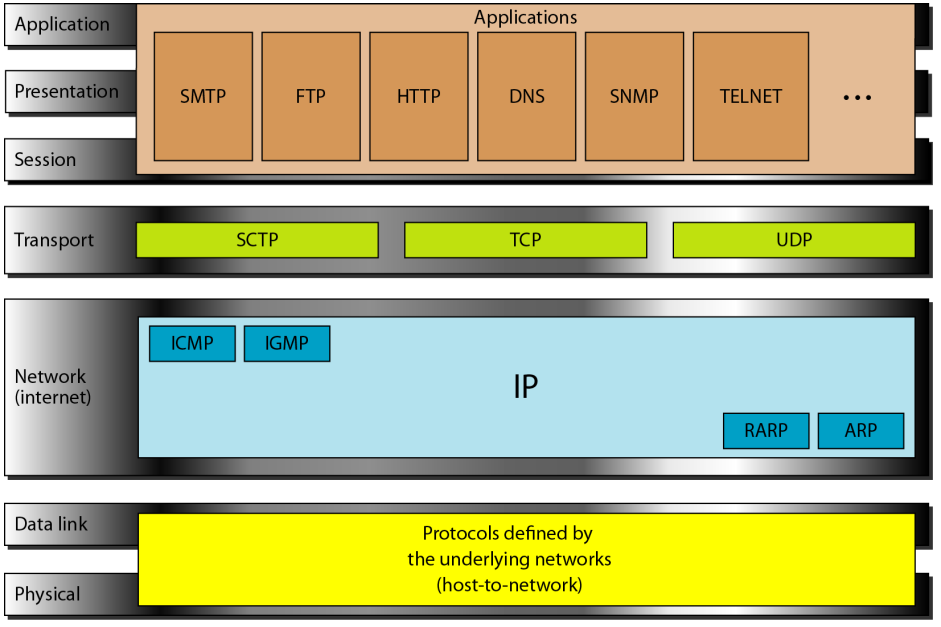

# ELC1017 - Redes de Computadores

## Visão Geral

### Critérios de redes

Uma rede deve ser capaz de atender os critérios:

- Desempenho
  - Medidas de vasão/atraso
- Confiabilidade
  - Frequência de falhas e tempo de recuperação
- Segurança
  - Proteção ao acesso não autorizado

### Fluxp de dados

Comunicação entre dois pontos pode ser:

- Simplex
  - Um sentido de transmissão de dados
- Half-duplex
  - Ambos sentidos
  - Um de cada vez
- Full-duplex
  - Ambos sentidos
  - Ao mesmo tempo

### Estruturas físicas

- Topologia física
  - Mesh (malha)
  - Star (estrela)
  - Bus (barramento)
  - Ring (anel)
  - Hybrid

### Redes locais (LANs)

- Local Area Network
  - Equipamentos operando em distancias curtas
  - Alta velocidade

### Redes Metropolitanas (MANs)

- Metropolitan Area Network
  - Equipamentos operando em distancias específicas (cidades/regiões)

### Redes de longa distância (WANs)

- Wide Area Network
  - Cobre áreas geograficamente dispersas
  - Estruturas de maior custo e complexibilidade
  - Interconexão de várias sub-redes

### Padrões internet

- RFC (Request for Comments)
  - [RFC](www.faqs.org)
- IETF (Internet Engineering Task Force)
  - [IETF](www.ietf.org)

### Entidades Básicas

Tipos de Servidores

- Arquivos
  - Serviços de armazenamento e acesso à informações
- Bancos de dados
  - Integridade referencial
  - Processos de consulta
- Impressão
  - Serviços de impressão
- Comunicação
  - Procedimentos de acesso à rede e interface com dispositivos do usuário
- Gerenciamento
  - Tráfego da rede
  - Desempenho
  - Identificação de falhas

### Protocolos

Em sistemas de comunicação, existem mensagens de controle desta comunicação além dos dados que se quer enviar.

- Capacidade de transmissão é dividida entre sinalização e informação
  - Diferentes protocolos terão diferentes *overheads*
  - Velocidade efetiva não considera *overhead*
- Protocolos Hierárquicos
  - Componentes em camadas
  - Isolar as camadas superiores dos detalhes de implementação dos níveos inferiores
  - Possibilitar a substituição da implementação de ua camada por outra
  - Modularização facilita implementação e atualização do sistema

### Open Systems Interconnection (OSI)

Divisão em 7 camadas

- L7 - Aplicação
- L6 - Apresentação
- L5 - Sessão
- L4 - Transporte
- **L3 - Rede**
- **L2 - Enlace**
- **L1 - Física**

As camadas L1 a L3 são obrigatoriamente implementadas pelo modem.

#### Nível Físico

- Transmissão de bits através do canal de comunicação

#### Nível de Enlace

- Enviar blocos de dados (quadros) através da ligação física
- Organizar o acesso ao meio físico
- Controle de erros
- Controle de fluxo

#### Nível de Rede

- Controle da sub-rede de comunicação
- Provê aos níveis superiores independência quanto às tecnologias utilizadas para conectar os sistemas
- Determina o caminho de um pacote através da sub-rede
- Conversão e compatibilidade de protocolos e esquemas de endereçamento

#### Nível de Transporte

- Provê comunicação transparente e confiável entre pontos finais
- Primeiro nível fim-a-fim do modelo OSI
- Controle de fluxo

#### Nível de Sessão

- Controle de diálogo
- Sincronização

#### Nível de Apresentação

- Provê independência para as aplicações em relação às diferentes formas de representação dos dados

#### Nível de Aplicação

- Transferência de arquivos
- e-mail
- Terminal virtual
- Serviços diretórios

### Visão dos Protocolos

## Endereçamento Lógico

`$ netstat -rn`
> Ver os endereços de encaminhamento, dos roteadores
