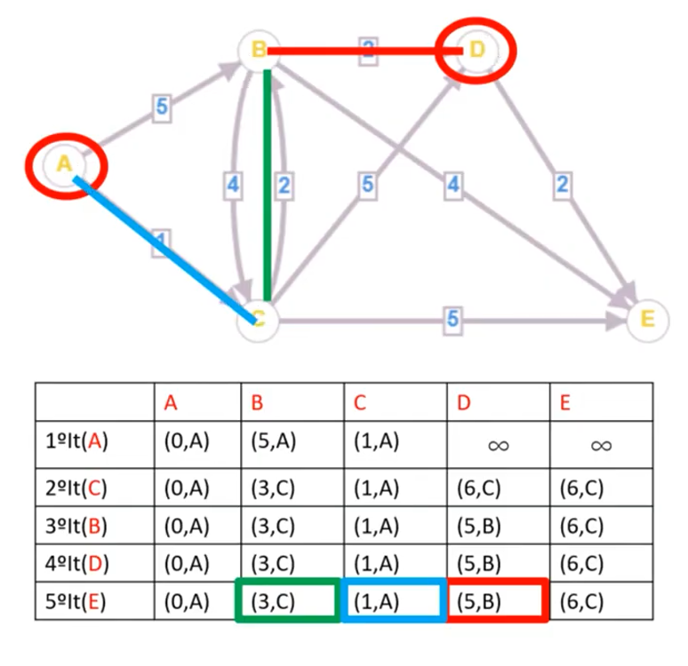

# 📘 Resumo – Análise e Projeto de Algoritmos

- Busca Binária
  - Com recursão
  - Sem recursão
- Recorrências
  - Método da iteração
    - Provar que a solução é correta pela indução matemática
- Algoritmo da Mochila Fracionária
  - Algoritmo guloso do slide
- Classes de complexidade
  - P
  - NP
  - NP-Completo
  - NP-Hard
  - Versões de decisão e otimização do caixeiro viajante
- Algoritmo de Dijkstra para grafo direcionado

---

## 🔍 Busca Binária

A busca binária é um algoritmo eficiente para encontrar um elemento em um vetor ordenado. Requer que os dados estejam **ordenados**.

- **Complexidade:** O(log n)

### 📌 Versão Iterativa (sem recursão)

```c
int buscaBinariaIter(int *array, int target, int end){
    int start = 0;
    int mid = (start + end) / 2;
    
    while(start <= end){
        if(target == array[mid]){
            return mid;
        } else if(target < array[mid]){
            end = mid - 1;
        } else {
            start = mid + 1;
        }
        mid = (start + end) / 2;
    }
    return -1; // element not found
}
```

### 📌 Versão Recursiva

```c
int buscaBinariaRec(int *array, int target, int start, int end){
    int mid;
    if(start <= end){
        mid = (start + end) / 2;
        if(target = array[mid]){
            return mid;
        } else if(target < array[mid]){
            return buscaBinariaRec(array, target, start, mid - 1);
        } else {
            return buscaBinariaRec(array, target, mid + 1, end);
        }
    }
    return -1; // element not found
}
```

---

## 🔁 Recorrências

Recorrências descrevem o tempo de execução de algoritmos recursivos.

### 🧠 Método da Iteração

Exemplo:  
$T(n) = 2T(\frac{n}{2}) + n$

Passos:

- Expandir a equação várias vezes:

```txt
T(n) = 2T(n/2) + n  
     = 4T(n/4) + 2n  
     = 8T(n/8) + 3n  
     = ...
     = 2^k T(n / 2^k) + kn
```

Se $n = 2^k$ → $k = log(n)$:

$T(n) = n \cdot T(1) + n \cdot log(n) ⇒ O(n \cdot log(n))$

---

### ✅ Prova por Indução

Etapas:

1. **Base:** Verifica para n = caso base.
2. **Hipótese:** Assume que vale para n = k.
3. **Passo indutivo:** Prova que vale para n = k + 1.

---

## 🎒 Mochila Fracionária

Permite levar **frações dos itens** para maximizar o valor total dentro da capacidade da mochila.

### ⚙️ Algoritmo Guloso

1. Ordena itens por valor/peso (v/p) decrescente.
2. Adiciona o máximo possível de cada item.

```python
def mochila_fracionaria(pesos, valores, capacidade):
    itens = sorted(zip(pesos, valores), key=lambda x: x[1]/x[0], reverse=True)
    total = 0
    for p, v in itens:
        if capacidade >= p:
            total += v
            capacidade -= p
        else:
            total += v * (capacidade / p)
            break
    return total
```

- **Complexidade:** O(n log n)

---

## 🧠 Classes de Complexidade

### ✅ P (Polynomial Time)

Problemas resolvidos em tempo polinomial (ex: O(n), O(n²), etc.).  
**Exemplo:** ordenação, busca, Dijkstra.

### ❓ NP (Non-deterministic Polynomial Time)

Problemas cujas soluções podem ser **verificadas** em tempo polinomial.  
**Exemplo:** mochila 0-1, caixeiro viajante (TSP).

### 🧩 NP-Completo

Problemas:

- Estão em NP
- Todo problema NP pode ser reduzido a eles em tempo polinomial

**Exemplo:** TSP (decisão), SAT

### 🔥 NP-Hard

Problemas tão difíceis quanto os NP-completos, **mas não precisam estar em NP**.  
**Exemplo:** TSP (otimização), problema do halting

---

## 🧭 TSP – Caixeiro Viajante

**Versão de Otimização:**
> Qual o menor caminho que visita todas as cidades e retorna à origem?

- **Classificação:** NP-Hard

**Versão de Decisão:**
> Existe caminho com custo ≤ k que visita todas as cidades uma vez?

- **Classificação:** NP-Completo

---

## 📍 Algoritmo de Dijkstra (Grafo Direcionado)

Resolve o problema de **menor caminho** a partir de um vértice origem em grafos com pesos **não-negativos**.

### 🧾 Código em Python

```python
import heapq

def dijkstra(grafo, origem):
    dist = {v: float('inf') for v in grafo}
    dist[origem] = 0
    visitados = set()
    fila = [(0, origem)]

    while fila:
        d, u = heapq.heappop(fila)
        if u in visitados:
            continue
        visitados.add(u)

        for v, peso in grafo[u]:
            if dist[u] + peso < dist[v]:
                dist[v] = dist[u] + peso
                heapq.heappush(fila, (dist[v], v))

    return dist
```

### 💡 Complexidade

- Com min-heap (heapq): **O((V + E) log V)**

### 📌 Exemplo


